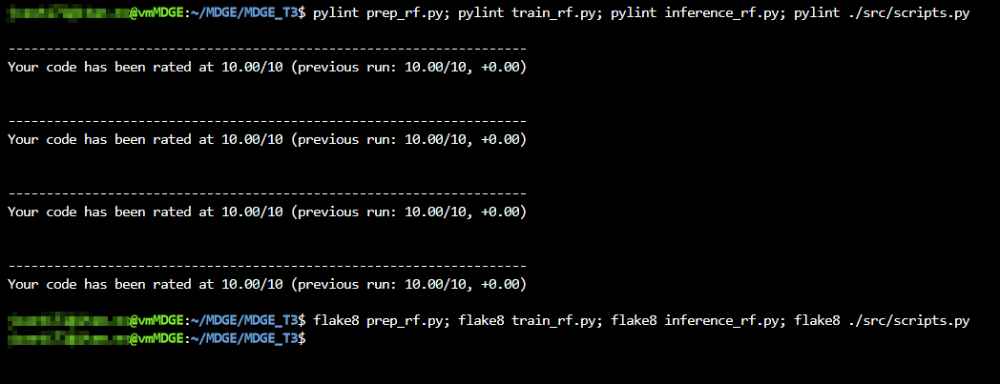
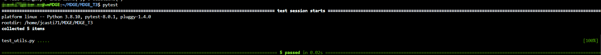
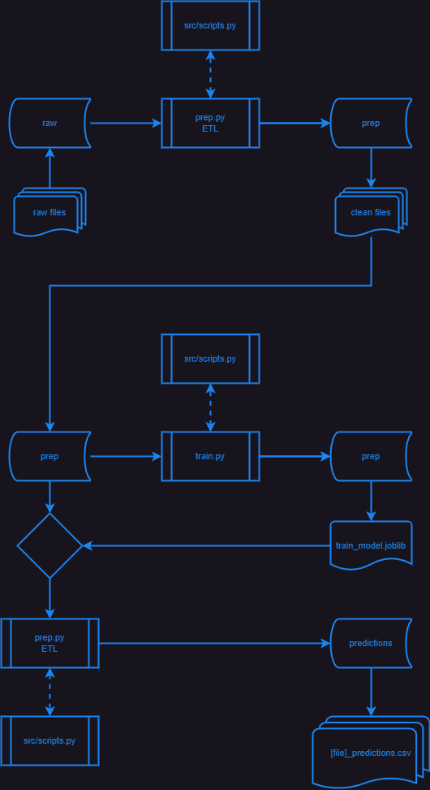

# MDGE_T3

## Descripción

Este repositorio contiene la tarea 3 de la materia de Métodos de Gran Escala. 2024-1.

## Árbol del repositorio

El repositorio está organizado de la siguiente forma:

```bash
.
├── README.md
├── __pycache__
│   └── test_utils.cpython-38-pytest-8.0.1.pyc
├── config.yaml
├── data
│   ├── inference
│   │   └── test.csv
│   ├── predictions
│   │   └── test_predictions.csv
│   ├── prep
│   │   ├── test.csv
│   │   └── train.csv
│   ├── raw
│   │   ├── test.csv
│   │   └── train.csv
│   ├── test.csv
│   └── train.csv
├── inference.py
├── inference_rf.py
├── lint_proof.png
├── logs
│   ├── test_debug_logger_20240223-081414.log
│   ├── test_debug_logger_20240223-081730.log
│   ├── test_error_logger_20240223-081414.log
│   ├── test_error_logger_20240223-081730.log
│   ├── test_format_test_20240223-081414.log
│   ├── test_format_test_20240223-081730.log
│   ├── test_info_logger_20240223-081414.log
│   ├── test_info_logger_20240223-081730.log
│   ├── test_logger_20240223-081414.log
│   └── test_logger_20240223-081730.log
├── models
│   ├── model_20240223-073343.joblib
│   └── train_model.joblib
├── notebooks
│   └── Tarea_01_MDGE_169589_Javier_Castillo_Millan.ipynb
├── prep.py
├── prep_rf.py
├── src
│   ├── __pycache__
│   │   ├── scripts.cpython-38.pyc
│   │   └── utils.cpython-38.pyc
│   ├── scripts.py
│   └── utils.py
├── test_utils.py
├── train.py
└── train_rf.py

11 directories, 36 files
```

## Contenido

### root

- [README.md](README.md)
  - Este archivo.
- [inference.py](inference.py)
  - Script que realiza la inferencia con el modelo entrenado y los datos de prueba.
  - La salida se guarda en la carpeta predictions.
- [inference_rf.py](inference_rf.py)
  - Versión refactorizada del script [inference.py](inference.py).
- [prep.py](prep.py)
  - Script que realiza el preprocesamiento de los datos de entrenamiento y prueba.
  - La salida se guarda en la carpeta prep.
- [prep_rf.py](prep_rf.py)
  - Versión refactorizada del script [prep.py](prep.py).
- [train.py](train.py)
  - Script que realiza el entrenamiento del modelo.
  - La salida se guarda en la carpeta models.
  - Este script es el que se usó para entrenar el modelo que se encuentra en la carpeta models.
- [train_rf.py](train_rf.py)
  - Versión refactorizada del script [train.py](train.py).
- [test_utils.py](test_utils.py)
  - Script que contiene las pruebas unitarias para los scripts del archivo [scripts.py](src/scripts.py).
  - Se ejecuta con pytest.

### data

- Inference
  - Contiene los archivos que se usan para ejecutar la inferencia con el script del mismo nombre [inference.py](inference.py).
- predictions
  - Contiene el resultado de la inferemcia después de ejecutar el script de inferencia. Guarda un resultado por cada archivo que haya sido enviado a inferencia usando [inference.py](inference.py)
- prep
  - Aquí se almacenan los datos resultados del preprocesamiento con el script de preprocesamiento [prep.py](prep.py).
- raw
  - Estos son los datos que toma el script de preprocesamiento [prep.py](prep.py) para generar los datos en la carpeta prep.
- [test.csv](data/test.csv)
  - Este archivo es el original provisto por la competencia de kaggle y se usa para realizar la inferencia. También se usa como insumo para los scripts de la tarea.
- [train.csv](data/train.csv)
  - Este archivo es el original provisto por la competencia de kaggle y se usa para realizar el entrenamiento. Tambien se usa como insumo para los scripts de la tarea.

### logs

Aquí encontramos los archivos de logs generados por la función de logging de Python.

### models

Aquí se almacenan los modelos entrenados.

### notebooks

- Se encuentra el archivo [Tarea_01_MDGE_169589_Javier_Castillo_Millan.ipynb](Tarea_01_MDGE_169589_Javier_Castillo_Millan.ipynb) que contiene el desarrollo de la tarea 1, contiene un análisis exploratorio y el entrenamiento; lo cual, sirvió como fundamento para crear este repositorio y sus funcionalidades.

### src

- [scripts.py](src/scripts.py)
  - Contiene las funciones que se usan en los scripts de la carpeta notebooks.
  - Esto se hizo con la intención de ejecutar refactorización de código y modularizar el código. Tal cual se pidió en las instrucciones de la tarea.
- [utils.py](src/utils.py)
  - Contiene una función para registrar los logs de los scripts durante su ejecución.

## Refactorización

[](https://github.com/pylint-dev/pylint)
[](https://flake8.pycqa.org/en/latest/)

Uno de los requisitos de la tarea fue la ejecución de linting con pylint y flake8.

El resultado de la ejecución de ambos sobre los scripts de Python mostró todos los códigos refactorizados con 10 de 10 de calificación en Pylint y sin mensajes en Flake8.

El resultado fue el siguiente:

```bash
xxx@xxx.xxx@vmMDGE:~/MDGE/MDGE_T3$ pylint prep_rf.py; pylint train_rf.py; pylint inference_rf.py; pylint ./src/scripts.py 

--------------------------------------------------------------------
Your code has been rated at 10.00/10 (previous run: 10.00/10, +0.00)


--------------------------------------------------------------------
Your code has been rated at 10.00/10 (previous run: 10.00/10, +0.00)


--------------------------------------------------------------------
Your code has been rated at 10.00/10 (previous run: 10.00/10, +0.00)


--------------------------------------------------------------------
Your code has been rated at 10.00/10 (previous run: 10.00/10, +0.00)

xxx@xxx.xxx@vmMDGE:~/MDGE/MDGE_T3$ flake8 prep_rf.py; flake8 train_rf.py; flake8 inference_rf.py; flake8 ./src/scripts.py 
xxx@xxx.xxx@vmMDGE:~/MDGE/MDGE_T3$ 
```

En la siguiente imagen podemos apreciar la evidencia:



## Pytest

Se ejecutaron pruebas unitarias con pytest. El resultado fue el siguiente:



## Arquitectura

La arquitectura de este repositorio se basa en la modularización del código. Se crearon funciones que se usan en los scripts de la carpeta root. Estas funciones se encuentran en el archivo [scripts.py](src/scripts.py).

Además, se creó un archivo [utils.py](src/utils.py) que contiene una función para registrar los logs de los scripts durante su ejecución.

Está conformado por 3 procesos

- Preprocesamiento
  - Se realiza con el script [prep_rf.py](prep_rf.py)
    - Este script toma los datos crudos de la carpeta data/raw y los procesa para dejarlos listos para el entrenamiento.
    - La salida se guarda en la carpeta data/prep.
- Entrenamiento
  - Se realiza con el script [train_rf.py](train_rf.py)
    - Este script toma los datos procesados de la carpeta data/prep y entrena un modelo.
    - La salida se guarda en la carpeta models.
- Inferencia
  - Se realiza con el script [inference_rf.py](inference_rf.py)
    - Este script toma el modelo entrenado y los datos de prueba para realizar la inferencia.
    - La salida se guarda en la carpeta data/predictions. 

El diagrama de arquitectura se muestra a continuación:



## Tareas solicitadas

Las instrucciones de las tareas que condujeron la construcción de este repositorio se encuentran en [tareas](https://github.com/Druizm128/arquitectura_de_producto_de_datos_2024/tree/main/tareas)
